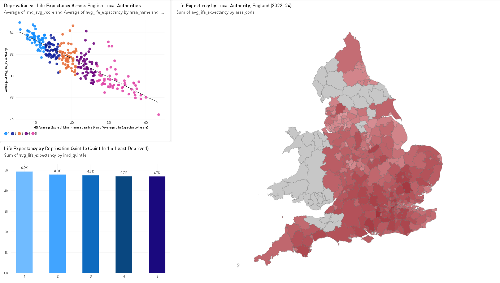

# Health Inequalities Dashboard: Deprivation and Life Expectancy in England

A reproducible Python/SQL/Power BI pipeline quantifying the relationship between area-level deprivation and life expectancy across 292 English local authorities, using open ONS and MHCLG data.

## Key Findings
- **3.9-year life expectancy gap** between England's least and most deprived local authority quintiles (83.4 vs 79.5 years)
- **Strong correlation** between deprivation and life expectancy (r = -0.86, R² = 0.74) across 292 local authorities
- The gap is **larger for men (4.4 years) than women (3.5 years)**

See [METHODS.md](METHODS.md) for full methodology, data sources, and limitations.

## Dashboard



## Project Structure
health-inequalities-dashboard/
├── README.md
├── METHODS.md
├── requirements.txt
├── data/
│ ├── raw/ # downloaded ONS/MHCLG files + sources.md
│ └── processed/ # joined, cleaned table
├── src/
│ ├── fetch_data.py
│ ├── inspect_raw.py
│ ├── parse_health_data.py
│ ├── load_to_db.py
│ └── analyze.py
├── sql/
│ └── schema.sql
├── outputs/
│ ├── figures/ # dashboard screenshot
│ ├── results.csv # correlation/regression results
│ └── quintile_summary.csv
├── dashboard/
│ └── health_inequalities.pbix
└── db/
└── health_inequalities.sqlite


## How to Reproduce
```bash
git clone https://github.com/<your-username>/health-inequalities-dashboard.git
cd health-inequalities-dashboard
python3 -m venv venv
source venv/bin/activate  # venv\Scripts\Activate.ps1 on Windows
pip install -r requirements.txt

python3 src/fetch_data.py
python3 src/parse_health_data.py
python3 src/load_to_db.py
python3 src/analyze.py
```
Then open `dashboard/health_inequalities.pbix` in Power BI Desktop.

## Data Sources
- ONS, *Life expectancy for local areas of the UK: between 2001 to 2003 and  2022 to 2024* (released 10 December 2025)
- MHCLG, *English Indices of Deprivation 2025*, File 10 — Local Authority District summaries, lower tier (published 30 October 2025, updated  17 November 2025)

Full source documentation: [data/raw/sources.md](data/raw/sources.md)